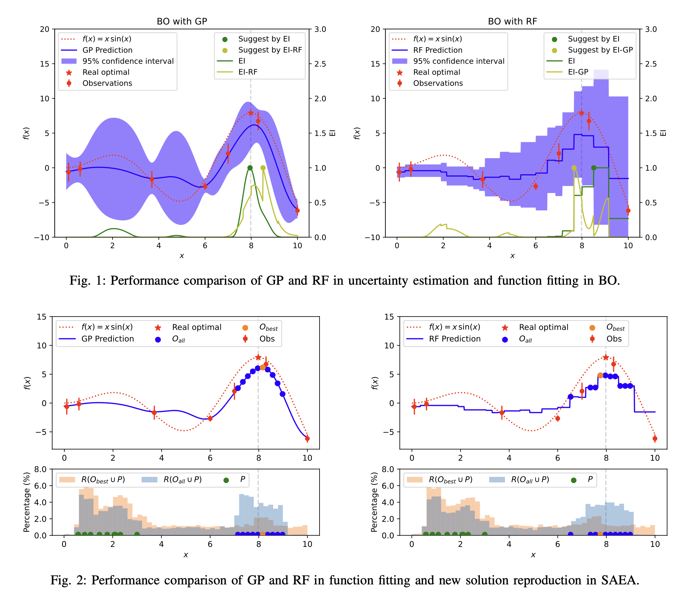

# Relation Model

Ths repository has collected some of our research work and code implementations on the **relation model**. The Matlab version implementation of the **relation model** can be found [here](https://github.com/hhyqhh/Relation-matlab/). 


* Python package compatible with [pymoo](https://github.com/anyoptimization/pymoo) (0.6.1) 
* Matlab package compatible with [PlatEMO](https://github.com/BIMK/PlatEMO) (4.x)  
---


## Implementation

### Relation Model assisted Evolutionary Algorithm
| algorithm | python | matlab |
| --------- | :----: | :----: |
| RCPS      |   ✅    |        |
| RCPS-MOEA |        |   ✅    |
| REMO      |        |   ✅    |
| CREMO     |        |   ✅    |
| DRSO      |   ✅    |        |


### Basic Algorithm
| algorithm | python | matlab |
| --------- | :----: | :----: |
| EDA/LS    |   ✅    |       |
| CoDE      |   ✅    |       |
---

### Other expensive optimization (Black-box optimization) related work 
| algorithm | python | matlab |
| --------- | :----: | :----: |
| UEDA  |    ✅    |     |

## Usage

The Python version algorithm is fully compatible with the pymoo framework.

First, install the package by running the following command in the root directory of the repository:
```bash
pip install -r requirements.txt
python setup.py develop
```

An example of using the DRSO algorithm to solve the LZG01 problem is shown below:
```python
from pymoo.optimize import minimize
from problem.single.LZG import LZG01, LZG02, LZG03, LZG04
from loguru import logger
from algorithm.saea.drso import DRSO


logger.remove()
problem = LZG01(n_var=20)
algorithm = DRSO()
res = minimize(problem,
                algorithm,
                ('n_evals', 500),
                verbose=True)

```

## Relaton Model assisted Evolutionary Algorithm
### RCPS 

In this work, we propose using relation models for pre-selection operations to accelerate the convergence speed of evolutionary algorithms. ([code](https://github.com/hhyqhh/Relation/blob/main/algorithm/saea/rcps.py), [paper](https://ieeexplore.ieee.org/document/9060983))


>Hao H, Zhang J, Lu X, et al. Binary relation learning and classifying for preselection in evolutionary algorithms[J]. IEEE Transactions on Evolutionary Computation, 2020, 24(6): 1125-1139.


### RCPS-MOEA

We extend RCPS to the multi-objective problem (MOP), accelerating the convergence speed of multi-objective evolutionary algorithms by predicting approximations domination between two solutions through relation models. ([code](https://github.com/hhyqhh/Relation-matlab/blob/main/PlatEMO-4.5/Algorithms/Multi-objective%20optimization/RCPS-MOEA/), [paper](https://ieeexplore.ieee.org/abstract/document/9504781)) 

> Hao H, Zhou A, Zhang H. An approximated domination relationship based on binary classifiers for evolutionary multiobjective optimization[C]//2021 IEEE Congress on Evolutionary Computation (CEC). IEEE, 2021: 2427-2434.


### REMO
>Hao H, Zhou A, Qian H, et al. Expensive multiobjective optimization by relation learning and prediction[J]. IEEE Transactions on Evolutionary Computation, 2022, 26(5): 1157-1170.

In this work, by designing a relation model to assist the evolutionary algorithm in solving expensive multi-objective optimization problems, the paper proposes an adaptive classification strategy and a voting scoring strategy to enhance the performance of relation models. ([code](https://github.com/hhyqhh/Relation-matlab/blob/main/PlatEMO-4.5/Algorithms/Multi-objective%20optimization/REMOHH/), [paper](https://ieeexplore.ieee.org/abstract/document/9716917))


### CREMO
>Hao H, Zhou A. A Relation Surrogate Model for Expensive Multiobjective Continuous and Combinatorial Optimization[C]//International Conference on Evolutionary Multi-Criterion Optimization. Cham: Springer Nature Switzerland, 2023: 205-217.

We apply convolutional neural networks~(CNN) to the learning of relation data, effectively overcoming challenges related to data types and dimensions, and demonstrating good performance on continuous, discrete problems as well as mid-to-high dimensional issues. ([code](https://github.com/hhyqhh/Relation-matlab/blob/main/PlatEMO-4.5/Algorithms/Multi-objective%20optimization/CREMO/), [paper](https://link.springer.com/chapter/10.1007/978-3-031-27250-9_15)) 


### DRSO 
>Hao H, Zhang X Q, Zhou A M. Enhancing SAEAs with unevaluated solutions: a case study of relation model for expensive optimization. Sci China Inf Sci, 2024, 67(2): 120103, doi: 10.1007/s11432-023-3909-x

Our observations indicate that updating solely the most favorable solution leads to a reduction in the genetic diversity amongst successive generations, prompting a stagnation of sorts, akin to marching in place. To address this issue, we have devised two relation modeling strategies that entail selecting not only the optimal solution from each generation but also a subset of promising solutions for the update of the population. Leveraging the robust learning and predictive capabilities of the relation model, this approach can significantly enhance the quality of solutions in subsequent generations, thereby elevating the overall efficiency of the algorithm. ([code](https://github.com/hhyqhh/Relation/blob/main/algorithm/saea/drso.py), [paper](https://link.springer.com/article/10.1007/s11432-023-3909-x))


---

## Expensive Optimization Related Work

Some of my other research works on **expensive optimization** (also know as Black-box optimization) are also included here.

### UEDA

This work, we compared and analyzed the differences between Bayesian optimization and evolutionary optimization in utilizing model uncertainty. We propose that within the evolutionary framework, the inclusion of unevaluated populations can overcome the utilization of model uncertainty and also mitigate misleading effects caused by model errors. We refer to this method as unevaluated population estimated distribution algorithm (UEDA). Experiments conducted on a series of test functions show that UEDA has advantages in utilizing model uncertainty. ([code](https://github.com/hhyqhh/Relation/blob/main/algorithm/saea/ueda.py), [paper](https://arxiv.org/pdf/2403.14413.pdf)) 

>Hao, H., Zhang, X., & Zhou, A. (2024). Model Uncertainty in Evolutionary Optimization and Bayesian Optimization: A Comparative Analysis. arXiv preprint arXiv:2403.14413. (This manuscript has been accepted by CEC2024)





---

## Basic Algorithm
This repository also contains some basic algorithm implementations. 

### EDA/LS

> Zhou A, Sun J, Zhang Q. An estimation of distribution algorithm with cheap and expensive local search methods[J]. IEEE Transactions on Evolutionary Computation, 2015, 19(6): 807-822.

[code](https://github.com/hhyqhh/Relation/blob/main/algorithm/base/edals.py)

### CoDE

> Wang Y, Cai Z, Zhang Q. Differential evolution with composite trial vector generation strategies and control parameters[J]. IEEE transactions on evolutionary computation, 2011, 15(1): 55-66.

[code](https://github.com/hhyqhh/Relation/blob/main/algorithm/base/composite_de.py)